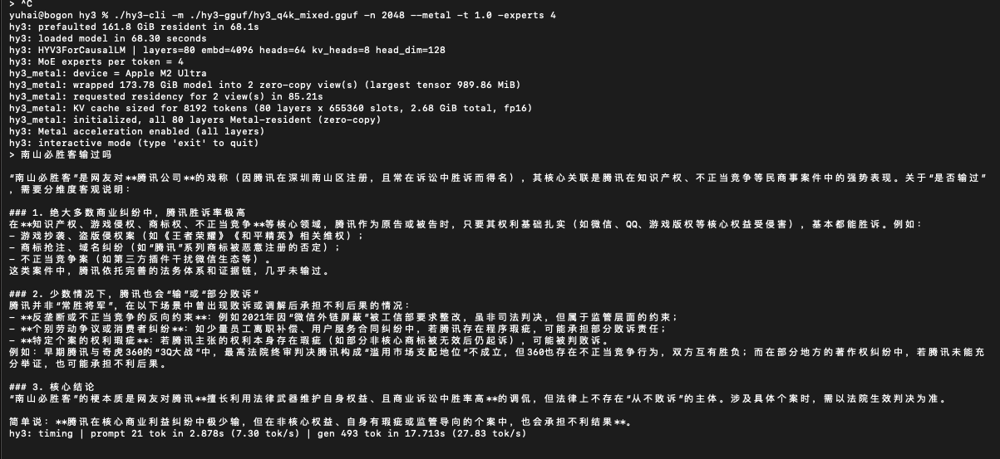

# hy3 — tencent/Hy3 GGUF Converter and Inference Engine



`hy3` is a from-scratch C inference engine and GGUF converter for **tencent/Hy3**
(`HYV3ForCausalLM`, `model_type: hy_v3`), a 295B-parameter / 21B-active-parameter
Mixture-of-Experts model released by **Tencent's Hunyuan ("Hy") team**
(`tencent/Hy3` on Hugging Face).

The project is called **hy3**.

> **Derivative project.** hy3 is a third-party derivative of the official
> **[`tencent/Hy3`](https://huggingface.co/tencent/Hy3)** model — it re-implements
> loading/inference from scratch and is not affiliated with or endorsed by Tencent.
> Pre-converted GGUF weights produced by this project's converter can be
> downloaded from **[`cloudyu/hy3-gguf`](https://huggingface.co/cloudyu/hy3-gguf)**.

## Status

Supports **CPU**, **CUDA**, and **Metal**. All verified.

**Context length: 262144 native. ~1M is CUDA-only.** Opt-in YaRN RoPE scaling
works on all three backends (`--rope-factor` / `HY3_ROPE_*`), but reaching ~1M
also needs the **INT4 KV cache, which is implemented on CUDA only**
(`HY3_KV_INT4=1`): on CUDA the engine *runs* ~1M-token contexts on a single
275 GB GPU (INT4 KV ≈ 81 GB @ 1M + 183 GB weights fits). CPU (FP32 KV ≈ 640 GB
@ 1M) and Metal (FP16 KV ≈ 320 GB @ 1M) have no INT4 path, so 1M does **not**
fit there — they remain practical only near the native context. The YaRN
frequency math is verified bit-exact against `transformers` and needle-retrieval
passes in-range; note that **>262144 is extrapolation** past what the base model
was trained on, so long-range quality there is not guaranteed. See
[Long context beyond 262144](#long-context-beyond-262144-yarn--int4-kv--experimental).

On a single **NVIDIA B300**: **~50 tok/s** end-to-end (decode), **~58 tok/s**
prefill with chunked prefill (`HY3_PREFILL_CHUNK`).

**Quality:** 11/13 (85%) on the `eval/hy3_eval.py` reasoning/coding benchmark
(CUDA, 80 layers, experts 8, think off, temp 1.0) — unchanged by the
long-context/serving features below, which are all off by default.

**Serving features (CUDA):**
- **Chunked prefill** (`HY3_PREFILL_CHUNK=N`) — batched-GEMM + FlashAttention-2-style
  batched attention; ~1.9× faster prefill at 8k, more at longer contexts.
- **Prefix caching** (multi-turn, `--convo`) — reuse the KV cache across turns,
  prefilling only each turn's new tokens (per-turn prefill 72 → 249+ tok/s).
- **INT4 KV cache** (`HY3_KV_INT4=1`) + **YaRN** (`--rope-factor`) for long context.

On **M2 Ultra** (192 GB): **~22 tok/s**.

GGUF:
https://huggingface.co/cloudyu/hy3-gguf
https://huggingface.co/autotrust/hy3-heretic-gguf (decensored / abliterated gguf)

Full optimization history → [`docs/CUDA_OPTIMIZATION.md`](docs/CUDA_OPTIMIZATION.md)
([中文](docs/CUDA_OPTIMIZATION.zh.md)) and [`docs/METAL_OPTIMIZATION.md`](docs/METAL_OPTIMIZATION.md).

> **Build note (CUDA):** use the plain `sm_90`/`sm_100`/`compute_100` nvcc arch
> flags the Makefile ships with. The `-a`-suffixed variants (`sm_90a`,
> `sm_100a`, `compute_100a`) compile and launch with no error but produce
> all-zero logits on this B300 / driver / CUDA 12.8 — do not add them back
> without re-verifying end-to-end on real hardware.

## Model facts

| | |
|---|---|
| Architecture | `HYV3ForCausalLM` (`hy_v3`) |
| Layers | 80 (layer 0 dense, layers 1-79 sparse/MoE) |
| Hidden size | 4096 |
| Attention heads | 64 (GQA, 8 KV heads, head_dim 128 — note `n_head*head_dim=8192 != hidden_size`) |
| Experts | 192 routed (top-8 activated) + 1 shared (always active) |
| Expert intermediate size | 1536 |
| Dense (layer 0) intermediate size | 13312 |
| Vocab size | 120832 (120818 real tokens + padding to a multiple of 128) |
| RoPE | theta 11158840, **`rotate_half` pairing** (dim `d` with `d+head_dim/2`) — NOT the interleaved `(2i,2i+1)` GPT-NeoX pairing. Verified against `transformers.models.hy_v3.modeling_hy_v3.apply_rotary_pos_emb`. |
| QK norm | RMSNorm applied per-head to Q and K, before RoPE |
| MoE routing | `sigmoid(router_logits)`; top-8 selected by `sigmoid + expert_bias`, but combined using the **unbiased** sigmoid weights, renormalized to sum 1, then scaled by `router_scaling_factor = 2.826` |
| MTP | `model.layers.80.*` is a multi-token-prediction layer, not used by this engine (matches upstream `transformers`, which also ignores it: `_keys_to_ignore_on_load_unexpected = [r"model\.layers\.80.*"]`) |

Reference implementation used to verify all of the above:
`transformers/models/hy_v3/modeling_hy_v3.py` (this environment has a
`transformers` build new enough to include native `hy_v3` support — no
`trust_remote_code` model file was needed).

## Project layout

```
hy3.c            Core inference engine: GGUF parsing, tokenizer, CPU forward
                 pass, sampling, generation loop.
hy3.h            Shared types, architecture constants, public API.
hy3_cli.c        CLI: `hy3` (interactive) and `hy3-cli` (prompt/batch) are the
                 exact same binary under two names (see Makefile).
hy3_convert.c    HuggingFace safetensors -> GGUF converter.
hy3_gpu.cu       CUDA backend (NVIDIA, Linux). --gpu-layers N offloads N
                 layers to one GPU's VRAM; remaining layers run on CPU.
hy3_cuda.cu/.h   Unused/dead code, not part of the build (Makefile builds
                 hy3_gpu.cu into hy3_cuda.o, not this file — kept only
                 because it predates the current build and nothing
                 references it).
hy3_metal.m      Metal backend (Apple Silicon, macOS). All 80 layers run on
                 Metal using zero-copy unified-memory buffers; no CPU split.
hy3.metal        Metal Shading Language compute kernels for hy3_metal.m.
run_metal.sh     Convenience build+run script for the Metal backend.
patch_gguf.py    Ad-hoc GGUF metadata patcher (older tool, kept for reference).
tests/
  hy3_test.c       Basic unit test.
  hy3_eval.c       6-question quality eval (GPQA Diamond / SuperGPQA / AIME
                   2025 excerpts), CPU only, greedy decode, answer-graded.
  hy3_eval_fast.c  2-question subset of the above, CPU only.
  hy3_eval_gpu.c   Same idea as hy3_eval.c, plus optional CUDA offload and a
                   configurable model path / thread count (see -h/usage in
                   the file); this is the one to adapt for Metal testing too,
                   since hy3_eval_metal/hy3_metal_init share the same API
                   shape hy3_gpu_init/hy3_eval_gpu use.
  hy3_quick_check.c  Minimal 4-prompt smoke test (arithmetic, factual
                     recall, one longer reasoning question, one arithmetic
                     word problem), meant to run in well under a minute.
```

## Building

The Makefile auto-detects the platform:

- **Linux with the CUDA toolkit installed** (`/usr/local/cuda/include/cuda_runtime.h`
  present): builds the CUDA backend (`hy3_gpu.cu`), `--gpu-layers` CLI flag
  available. Builds fat binaries for both Hopper (`sm_90a`) and Blackwell
  (`sm_100a` + `compute_100a` PTX, which the driver JIT-compiles to real
  SASS on Blackwell Ultra/B300 and other same-generation chips newer than
  this `nvcc`'s named targets — see `NVCC_ARCH_FLAGS` in the Makefile to
  override). If your `nvcc` isn't on `$PATH` as a symlink resolved from its
  real CUDA install directory (e.g. `/usr/bin/nvcc -> /usr/local/cuda/bin/nvcc`
  but invoked as `/usr/bin/nvcc`), it may fail to find `cicc`/`nvvm`
  internally (`... /usr/bin/../nvvm/bin/cicc: not found`) — pass
  `make NVCC=/usr/local/cuda/bin/nvcc` (its real path) to work around this.
- **macOS** (`Darwin`): builds the Metal backend (`hy3_metal.m` +
  `hy3.metal`), `--metal` CLI flag available. Needs Xcode command line tools
  (`xcode-select --install`). OpenMP is optional on macOS (only affects the
  speed of any CPU-side code, not Metal correctness) — install via
  `brew install libomp` if you want it; the build falls back to
  single-threaded CPU code cleanly if it's absent.
- **Anything else**: CPU-only build.

```bash
make -j$(nproc)              # auto-detect backend
make HY3_CUDA=0 -j$(nproc)   # force CPU-only on a CUDA-capable Linux box
```

Produces three binaries: `hy3` (interactive REPL), `hy3-cli` (same binary,
prompt/batch mode — see hy3_cli.c, they're built from identical objects),
and `hy3-convert` (the GGUF converter).

On macOS, prefer `./run_metal.sh` over calling `make`/`./hy3-cli` directly —
it rebuilds automatically when the Metal sources change and adds `--metal`.

## Converting a HuggingFace checkpoint to GGUF

```bash
./hy3-convert -i /path/to/Hy3 -o hy3.gguf -t q4_k
```

`-t f32|q8_0|q4_k` picks a **precision scheme**, not a uniform dtype for
every tensor. `q8_0` and `q4_k` are equivalent and both select the
mixed-precision layout below (`select_ggml_type()` in hy3_convert.c is the
single source of truth):

| Tensor | dtype | Why |
|---|---|---|
| Routed experts (`ffn_{gate,up,down}_exps`) | Q4_K | Bulk of the model (45504 of 47138 tensors); sparsely activated (8/192 per token), so lower precision here has limited per-token impact. Always Q4_K regardless of `-t` (except `-t f32`, see below). |
| `token_embd.weight` | F16 | Large (495M elements) but a straight lookup table, not matrix-multiplied; F16 is effectively lossless for embedding magnitudes and halves its size vs F32. |
| `output.weight`, attention `q/k/v/o`, shared-expert FFN, dense-layer (0) FFN | Q8_0 | These are *always active* every token (unlike routed experts), and `output.weight` directly determines the final logits — worth the extra bits. |
| Norms, router gate, expert bias, unused MTP tensors (`eh_proj`/`enorm`/`hnorm`/`final_norm`) | F32 | Tiny; precision-critical; not worth quantizing. |

`-t f32` is a debug/reference escape hatch: everything is F32 except routed
experts, which are *always* Q4_K regardless of `-t` (uncompressed experts
would make the file >1TB).

hy3's Q8_0 is **not** upstream ggml's Q8_0 — it uses an F32 block scale (36
bytes/32 elements) instead of ggml's F16 scale (34 bytes/32 elements). This
is an internal format; don't expect other GGUF-reading tools to load these
files.

## Running inference

```bash
# CPU (all layers). -t sets the OpenMP thread count for CPU matmuls — pass
# something close to nproc, the default of 4 is very conservative.
./hy3-cli -m hy3.gguf -t "$(nproc)" -p "11+22+33=?" -n 32 -temp 0

# CUDA: offload N layers to one GPU's VRAM, rest run on (now-parallel) CPU.
./hy3-cli -m hy3.gguf --gpu-layers 40 -p "11+22+33=?" -n 32 -temp 0

# Metal (macOS): all layers run on Metal via unified memory.
./run_metal.sh -m hy3.gguf -p "11+22+33=?" -n 32 -temp 0

# Interactive mode: omit -p.
./hy3 -m hy3.gguf --gpu-layers 40
```

Key flags (`./hy3-cli -h` for the full list): `-n` tokens to generate,
`-temp` sampling temperature (`-temp 0` = greedy/deterministic, useful for
reproducible comparisons), `-top_k`/`-top_p`, `-t` CPU thread count,
`-experts` MoE experts activated per token.

### Keep the default: `-experts 8`

The checkpoint is natively top-8; that is the recommended and default setting.
Lowering `-experts` saves a little GPU work but **measurably degrades quality**,
so it is not recommended.

`-experts 4` was previously suggested as "equal quality, faster." A same-config
comparison (CUDA, `--gpu-layers 80`, think off, **`temp 0` greedy**) does not
support that: at `-experts 4` the model produces character-level corruption that
`-experts 8` does not — e.g. `ALL TESTS PASS` (dropped "ED"), `STRRESS TEST
DONE`, `SEGMENT TRREE OK`, and an outright crash on the multi-head-attention
task. Because greedy decoding is deterministic, these are real routing-capacity
losses, not sampling noise. The earlier "10/13 at `-experts 4`" number came from
a `temp=1.0` run and was misleading.

The on-device savings are also small in practice: `-experts 4` roughly halves the
routed matmul work, but end-to-end decode is dominated by the per-token graph,
120K-vocab sampling, detokenization, and attention over a growing KV cache, so
the net throughput gain is only a few percent. Not worth the quality hit.

If you nonetheless want to trade quality for a small speed/energy saving, you can
set `-experts 4` (or use `HY3_EVAL_EXPERTS` / `HY3_TOOL_EXPERTS`), but **do not go
below `-experts 3`**: `-experts 2` (and `1`) produce incoherent gibberish —
verified at both `--gpu-layers 20` and `80` with greedy decoding, a model-capacity
floor rather than a backend bug.

### Sizing GPU/Metal offload

CUDA (discrete VRAM, must fit weights + KV cache + scratch in one GPU):
roughly ~2.4-3GB per MoE layer with the mixed-precision GGUF (Q4_K-compressed
experts + F32-dequantized dense weights), ~1GB for the dense layer 0. An
H200 (144GB) comfortably fits `--gpu-layers 40-47`; going higher risks OOM.
The remaining CPU-resident layers are OpenMP-parallelized (`-t`), so they're
not the dominant bottleneck.

Metal (unified memory): no separate VRAM budget, so all 80 layers always run
on Metal — the constraint is just total system memory vs. the GGUF's size
plus a KV cache (default 8192 tokens ≈ 5.4GB, `HY3_METAL_CTX_TOKENS` env var
to change) plus small scratch buffers. On a 192GB Mac with the 173.78GB
mixed-precision GGUF this leaves headroom, but it's not huge — close other
memory-heavy applications.

## Long context beyond 262144 (YaRN + INT4 KV) — experimental

The published `tencent/Hy3` config is `max_position_embeddings: 262144` with
`rope_parameters.rope_type: "default"` — i.e. **no** RoPE scaling was trained
in. The engine reproduces that native rope exactly by default. Two opt-in
features let you push past the native context (e.g. toward ~1M):

- **YaRN RoPE scaling** (`--rope-yarn`, `--rope-factor <f>`, `--rope-ctx <n>`,
  or env `HY3_ROPE_FACTOR` / `HY3_CTX` / `HY3_ROPE_ORIG_CTX` /
  `HY3_ROPE_BETA_FAST` / `HY3_ROPE_BETA_SLOW` / `HY3_ROPE_ATTN_FACTOR`). This is
  the standard YaRN interpolation (Peng et al. 2023); the per-dim `inv_freq`
  table and mscale match `transformers`' `_compute_yarn_parameters` to float32
  precision (verified). Applied identically on CPU, CUDA, and Metal. **Off by
  default** — the default table is bit-for-bit the native rope.

  ```bash
  # ~1M target context (factor 4 over the native 262144)
  ./hy3-cli -m hy3.gguf --gpu-layers 80 --rope-factor 4 -p "..." -n 64
  ```

- **INT4 KV cache** (`HY3_KV_INT4=1`, CUDA only): 4 bits/element (528 B/slot
  vs INT8's 1040), halving KV footprint. This is what lets a full-model 1M-token
  context fit in a single B300's VRAM: INT8 KV at 1M ≈ 162 GB + 183 GB weights
  > 275 GB, whereas INT4 ≈ 81 GB + 183 GB fits. Same decode speed as INT8
  (~56 tok/s measured).

  ```bash
  HY3_KV_INT4=1 ./hy3-cli -m hy3.gguf --gpu-layers 80 --rope-factor 4 -p "..." -n 64
  ```

### Chunked prefill (`HY3_PREFILL_CHUNK`, CUDA) — faster long prompts

Long-context prompts are **prefill-bound** (ingesting the prompt dominates; the
answer is short). The default path processes prompt tokens one at a time, which
underutilizes the GPU. `HY3_PREFILL_CHUNK=<N>` (e.g. 512) processes the prompt
in chunks of N tokens on the full-GPU path, applying community techniques:

- **Chunked prefill** (SARATHI) — fixed-size token chunks that saturate compute.
- **Batched matmuls** — QKV / O-projection run as M=C cuBLAS GEMM instead of C
  separate GEMVs.
- **Batched causal attention** (FlashAttention-2 / FlashInfer style) — one fused
  online-softmax kernel per layer with a query tile, so the KV-cache read is
  amortized across the chunk (turns IO-bound prefill attention toward
  compute-bound). Works with INT8 and INT4 KV (dequant on the fly).

Measured (single B300, 8k-token needle prompt): prefill **30.7 → 58.4 tok/s
(~1.9×)** with identical output; the gain grows with context length since the
batched attention term dominates more as the prompt grows. Off by default;
greedy output is bit-identical to the per-token path. (Routed-expert MoE is
still per-token — a grouped-GEMM MoE would further cut the linear term.)

```bash
HY3_PREFILL_CHUNK=512 ./hy3-cli -m hy3.gguf --gpu-layers 80 -p "<long prompt>" -n 64
```

### Prefix caching (multi-turn) — reuse KV across turns

Multi-turn chat repeatedly prefills a growing conversation. Prefix caching keeps
the KV cache resident and, on each turn, reuses the longest token prefix that
matches the previous turn — so only the **new** tokens are prefilled instead of
re-processing the whole history.

`--convo <file>` runs one user turn per line as a single growing conversation
(KV persists across turns). It composes with chunked prefill (the new-suffix
prefill uses `HY3_PREFILL_CHUNK`). Always correct — only exact-match token
prefixes are reused; disable with `HY3_NO_PREFIX_CACHE=1`.

```bash
./hy3-cli -m hy3.gguf --gpu-layers 80 --convo turns.txt -n 128
```

Measured (single B300, 3-turn convo): turn 2 reused 64/80 prompt tokens
(prefill **72 → 249 tok/s**), turn 3 reused 81/96 (**→ 318 tok/s**); the model
correctly recalls facts from earlier turns, and `HY3_NO_PREFIX_CACHE=1` yields
identical answers (pure speedup). The saving grows with conversation length —
the entire history is reused rather than re-prefilled each turn.

> **This is extrapolation, not a supported context length.** Because the base
> model was never trained (or validated) above 262144, YaRN keeps output
> *coherent* past that point but cannot guarantee long-range retrieval quality.
> Validate for your use case with the needle harness before relying on it:
>
> ```bash
> python3 eval/hy3_needle.py --model hy3.gguf --gpu-layers 80 \
>     --tokens 300000 --depth 0.5 --yarn-factor 4 --kv-int4
> ```
>
> Measured so far (single B300):
> - **In-range dense** needle retrieval **passes** at 16727 / 34392 tokens for
>   YaRN-off, YaRN-factor-4, and YaRN-factor-4 + INT4-KV.
> - **Long-distance RoPE probe** (`HY3_POS_JUMP`): since RoPE is relative, the
>   extrapolation question is about the query↔needle *distance*, which a single
>   position jump reproduces cheaply (short dense prompt, one OOD gap, local
>   structure in-distribution). Result: at **~320k** distance both raw and YaRN
>   retrieve (the base theta 11.16M already extrapolates that far for a sparse
>   lookup); at **~1M** distance **raw RoPE fails but YaRN factor 4 retrieves
>   correctly** — the on/off control isolates YaRN as the cause. This verifies
>   the YaRN *rope-extrapolation mechanism* holds to 1M distance.
> - A genuine **dense** >262144-token run is memory-fitted by INT4 KV but is
>   ~O(n²) prefill-bound (~hours) on one GPU — see chunked prefill below.

## Testing

```bash
cd tests
gcc -O2 -fopenmp -I.. -o hy3_quick_check hy3_quick_check.c ../hy3.o ../hy3_cuda.o \
    -lm -lpthread -L/usr/local/cuda/lib64 -lcudart -lcublas   # Linux/CUDA build
./hy3_quick_check /path/to/hy3.gguf 90     # model path, thread count

gcc -O2 -fopenmp -I.. -o hy3_eval_gpu hy3_eval_gpu.c ../hy3.o ../hy3_cuda.o \
    -lm -lpthread -L/usr/local/cuda/lib64 -lcudart -lcublas
./hy3_eval_gpu <gpu_layers> /path/to/hy3.gguf [n_threads]
```

(Link against `../hy3.o` only, without `../hy3_cuda.o`/CUDA libs, for a
CPU-only test binary; adjust for Metal by linking `../hy3_metal.o` + the
`Metal`/`Foundation` frameworks instead.)

Higher-level Python suites live in `eval/` and drive the built `hy3-cli` once
in batch mode (model loads once):

```bash
python3 eval/hy3_eval.py            # 13-task reasoning/coding benchmark
python3 eval/hy3_tool_calling.py    # function/tool-calling test
```

Both honor `HY3_EVAL_*` / `HY3_TOOL_*` env vars (backend, `--gpu-layers`,
expert count, temperature, think mode) — see the file headers.

## Performance & optimization

This codebase started with several serious correctness bugs (symptom: greedy
`11+22+33=?` did not return `66`) — all fixed — and then went through several
rounds of performance work: KV-cache O(n²)→O(n), FP16 KV cache,
online-softmax attention, GPU-resident MoE routing, coalesced Q4_K expert
matmuls, CUDA-graph decode, shared/routed-expert stream overlap, and an FP32
router for routing stability across depth.

Rather than narrate all of it here, the full step-by-step account — each change,
the reasoning, and the measured effect — is documented separately:

- **[`docs/CUDA_OPTIMIZATION.md`](docs/CUDA_OPTIMIZATION.md)** — CUDA decode,
  4.6 → ~49 tok/s pure-GPU on a B300 (also
  [`docs/CUDA_OPTIMIZATION.zh.md`](docs/CUDA_OPTIMIZATION.zh.md), 中文).
- **[`docs/METAL_OPTIMIZATION.md`](docs/METAL_OPTIMIZATION.md)** — Metal backend
  optimization notes and suggestions.

**Mixed-precision GGUF.** `-t q4_k` keeps the routed experts at Q4_K (sparsely
activated, 8/192 per token) and uses Q8_0 for the always-active tensors
(attention q/k/v/o, `output.weight`, shared/dense FFN) and F32 for
norms/router/bias. This is smaller *and* higher average precision on the hot
path than a naive "everything but experts F32" baseline
(198.58GB → 173.78GB on the reference checkpoint).

